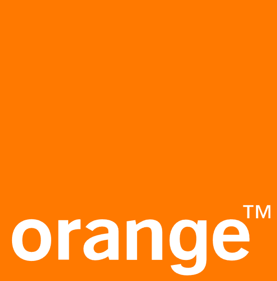
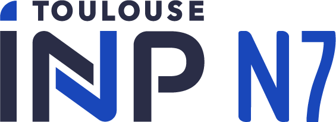
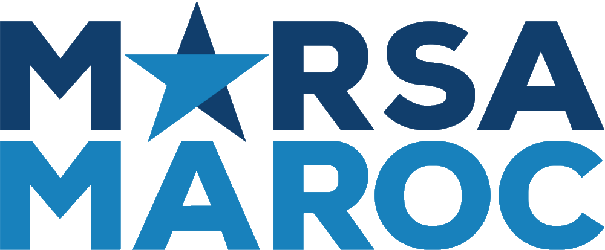

# Professional Experience

## { .title-logo } Cloud & DevOps Engineer — Contractor

**[Orange](https://www.orange.fr/portail) — [Davidson R&D](https://www.davidson.fr)**  
:material-calendar: *May 2022 – Present*  
:material-map-marker: *Sophia Antipolis, France*

Cloud & DevOps Engineer, working as a Contractor for [**Orange**](https://www.orange.fr/portail) within the **AAC (Architecture et Accompagnement Cloud)** team. Contributing to the automation, integration, modernization, and operation of applications and services across private-cloud environments, with a strong focus on reliability, security, maintainability, and DevOps best practices.

### Key Responsibilities

* **Deployment, operation, and maintenance** of cloud-native applications on **Kubernetes** and **Cloud Foundry**.
* **Migration of tools and applications** to standardized and sustainable on-premises cloud platforms, improving maintainability and long-term support.
* **Design and implementation** of application integration and automation workflows using **Apache Airflow**.
* **Setup and improvement** of **GitLab CI/CD pipelines** for automated testing, packaging, and application deployment.
* **Securing and management** of application secrets and sensitive configurations using **HashiCorp Vault** and encryption mechanisms.
* **Automation of resource provisioning and configuration**, including *DNS records, certificates, load-balancing services, and reverse proxies*.
* **Centralization of application and infrastructure logs** using the **ELK Stack**.
* **Implementation of monitoring, alerting, and observability solutions** with **Prometheus, Grafana, and Xymon**.
* **Definition and implementation of backup and disaster-recovery procedures** using **S3-compatible storage**.
* **Packaging, versioning, and publication** of internal libraries and application artifacts through **JFrog Artifactory**.
* **Development of internal APIs and web interfaces** using **Flask** and **FastAPI**.
* **Production incident investigation and root-cause analysis**, including corrective and preventive actions.
* **Production of technical documentation and operational procedures** to improve maintainability and knowledge sharing.

### Key Contributions

* **Automation of recurring infrastructure and application-management tasks**, reducing manual operations.
* **Standardization of reusable CI/CD pipelines**, improving deployment reliability and consistency.
* **Centralization of secrets and configuration management**, strengthening platform security.
* **Modernization and migration of workloads** toward maintained and sustainable private-cloud platforms.

  
  
  
  
  
  
  
  
  
  
  
  
  
  
  

---

## { .title-logo } DataOps Engineer — Internship

**[Strateg.In](https://strateg.in)**  
:material-calendar: *Aug 2021 – Feb 2022*  
:material-map-marker: *Toulouse, France*

**Master’s Final-Year Project (Projet de Fin d’Études – M2)** focused on designing and industrializing DataOps pipelines, from data preparation and machine-learning workflows to API integration and deployment on cloud-native infrastructure.

### Key Responsibilities

* **Design and implementation of customer data-processing workflows**, including extraction, cleaning, analysis, and machine-learning models such as *Random Forest, SVM, and XGBoost*.
* **Automation of DataOps workflows** using **Argo Workflows**, containerized with **Docker** and deployed on **Azure Kubernetes Service (AKS)**.
* **Development of APIs** for integration and production deployment of data-processing results.
* **Monitoring and visualization of pipeline performance** to improve processing reliability and operational visibility.
* **Integration of data-processing components** with storage, search, and application services.

  
  
  
  
  
  
  
  
  
  
  
  

---

## { .title-logo } Software Development Engineer — Internship

**[INP-ENSEEIHT](https://https://www.enseeiht.fr)**  
:material-calendar: *Jun 2020 – Aug 2020*  
:material-map-marker: *Toulouse, France*

Software development internship focused on the creation of educational tools for automated and interactive source-code evaluation at **INP-ENSEEIHT**.

### Key Responsibilities

* **Development of code-processing modules** for automated and interactive evaluation of programming exercises.
* **Implementation of source-code analysis mechanisms** based on *Abstract Syntax Trees (AST)*.
* **Development and integration** of educational tooling using *Python* and *Java*.
* **Version control and collaborative development** using *GitLab*.

  
  
  
  

---

## { .title-logo } Data Management System Developer — Internship

**[Marsa Maroc](https://www.marsamaroc.co.ma)**  
:material-calendar: *Jul 2019 – Aug 2019*  
:material-map-marker: *Casablanca, Morocco*

Software development internship focused on the implementation of an internal UI for managing training-room reservations.

### Key Responsibilities

* **Design and development of a desktop application** for training-room reservation management.
* **Implementation of data-management functionalities** using *MySQL*.
* **Development of the application logic and graphical interface** using *Java*.
* **Source-code versioning and project management** using *GitLab*.

  
  
  

